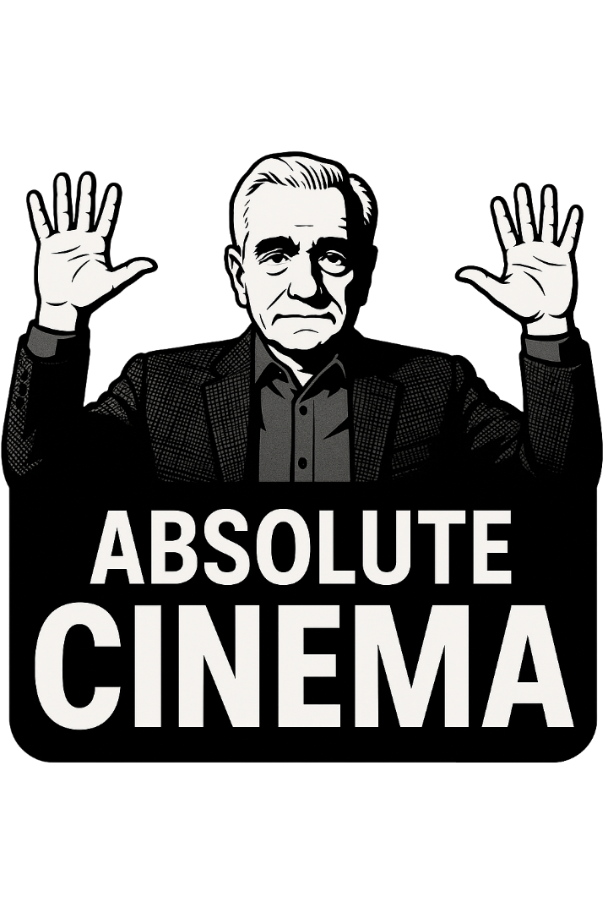
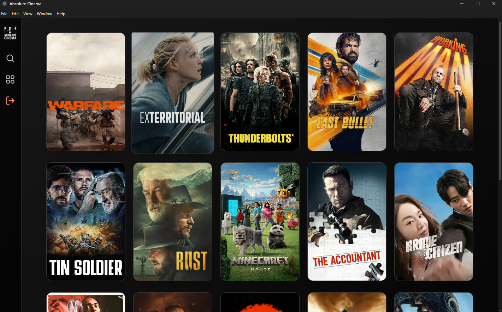
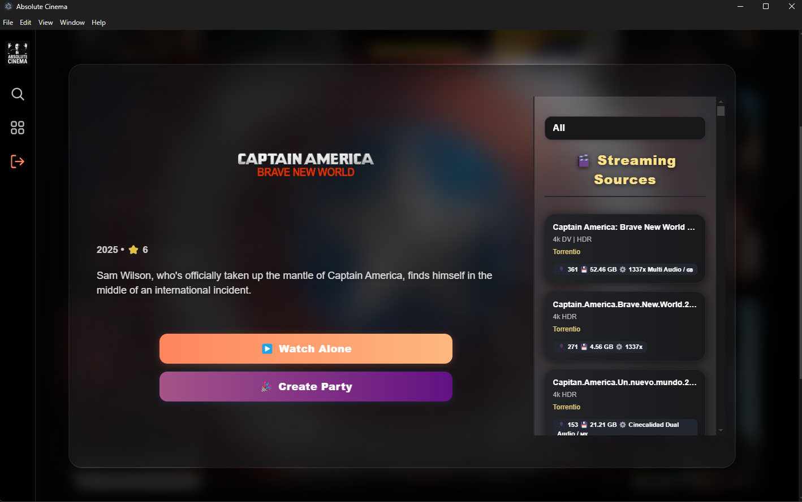

<!-- filepath: c:\Users\raezi\absolute-cinema\README.md -->
# Absolute Cinema 🎬

[](LICENSE)
[]()

Absolute Cinema is an open-source streaming platform that lets you watch movies and TV series alone or with friends. Host synchronized watch parties, chat in real time, and experience a fast interface backed by a scalable, multi-language backend.

<p align="center">
  
</p>

---

## ✨ Features

- 🎥 **Watch Together**: Host or join watch parties and sync playback with friends in real time
- 💬 **Live Chat**: Chat with friends while watching
- 🔌 **Custom Addons**: Support for custom Stremio addons
- 🛡️ **Room Management**: Create, join, and manage rooms easily
- ⚡ **Fast Streaming**: Efficient torrent streaming and video server
- 🔒 **Authentication**: Google OAuth and secure user management
- 📦 **Docker Support**: Easy deployment with Docker

## 🛠️ Tech Stack

- **Frontend**: Electron, React, JavaScript, TailwindCSS
- **Backend**: Go, Python
- **Streaming**: Node.js (torrent streaming), MPV (media playback)
- **Native Services**: C++ (window merger utility)
- **Database**: MongoDB, Redis
- **Other**: Docker, WebSockets

## 🚀 Getting Started

### Prerequisites
- Node.js (v18+)
- Go (v1.20+)
- Python (3.10+)
- MongoDB & Redis
- Docker (optional)

### Installation

```bash
# Clone the repository
git clone https://github.com/yourusername/absolute-cinema.git
cd absolute-cinema

# Install client dependencies
cd client
npm install

# Install torrent stream service dependencies
cd ../torrent-stream-service
npm install

# (Optional) Build Docker containers
docker-compose up --build
```

### Running the App

#### Development
```bash
# Start the backend server
cd server
go build

# Start the client (Electron)
cd ../client
npx vite build
npm run start

# Start the torrent stream service
cd ../torrent-stream-service
npm start
```

#### Production
See `docker-compose.yml` for full-stack deployment.

## 📸 Screenshots

<p align="center">
  
  
</p>

## 🤝 Contributing

Contributions are welcome! Please open issues and pull requests.

## 📄 License

This project is licensed under the MIT License. See the [LICENSE](LICENSE) file for details.

## 🙏 Credits

- Inspired by Stremio, Plex, and other open-source streaming platforms

---

Enjoy Absolute Cinema! 🍿
