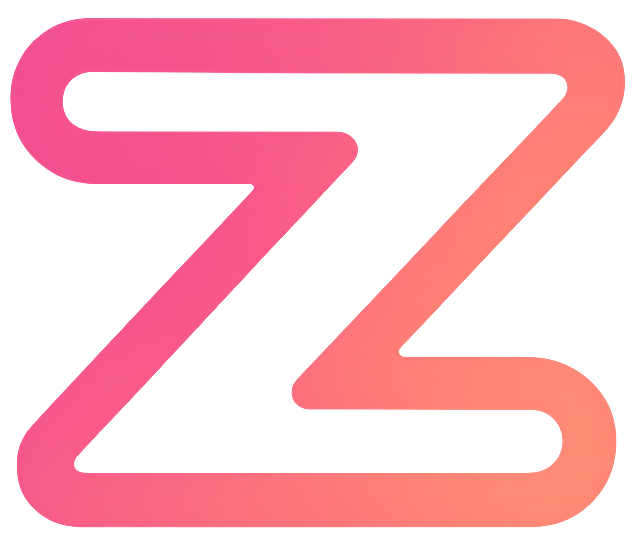

# Zync

<div align="center">
  
  [](LICENSE)
  [](https://www.typescriptlang.org/)
  [](https://www.electronjs.org/)
  [](https://reactjs.org/)
  [](https://go.dev/)

  

  <h3>An open-source streaming platform for synchronized movie and series viewing.</h3>
</div>

---

> [!NOTE]
> Actual video playback is currently only available on Windows.

## Features

- **Watch Together** - Host or join synchronized watch parties with friends
- **Live Chat** - Real-time communication while watching content
- **Custom Addons** - Support for custom Stremio addons
- **Room Management** - Create private rooms, invite friends, and manage your watch parties
- **Fast Streaming** - Efficient torrent streaming with WebTorrent and HLS conversion
- **Overlay Controls** - Unobtrusive UI with intuitive keyboard shortcuts

## Technology Stack

### Frontend
- **Framework**: Electron, React
- **Language**: TypeScript
- **Styling**: TailwindCSS 4, Framer Motion
- **UI Components**: Radix UI
- **Routing**: React Router DOM

### Backend
- **API Server**: Go
- **WebSockets**: Custom Go implementation
- **Authentication**: Google OAuth
- **Databases**: MongoDB, Redis

### Media & Streaming
- **Media Player**: MPV (libmpv)
- **Torrent Streaming**: Node.js microservice with WebTorrent

### Utilities
- **Window Management**: Custom C++ utility for merging windows
- **Containerization**: Docker and Docker Compose

## Getting Started

### Prerequisites
- Node.js (v18+)
- Go (v1.20+)
- MPV player (latest)
- MongoDB & Redis
- Docker (optional, for containerized deployment)

### Installation

```bash
# Clone the repository
git clone https://github.com/val-makkas/zync.git
cd zync

# Install client dependencies
cd zync-stream-client
npm install

# Install torrent stream service dependencies
cd .. && git clone https://github.com/val-makkas/zync-stream-torrentstream.git && cd zync-stream-torrentstream
npm install

## Install window-merger
cd ../tools && git clone https://github.com/val-makkas/window-merger.git
cd window-merger
```
and build using dev tools cmd with ```g++ window-merger.cpp -o window-merger.exe -lcomctl32 -static -static-libgcc -static-libstdc++```
```
# Set up environment variables

```

### Running the Application

#### Development Mode
```bash
# Start the backend server
cd server
go run main.go

# Start the torrent stream service
cd zync-stream
npm start

# Start the client (in a new terminal)
cd zync-client
npm run dev
```

#### Production Build
```bash
# Build the client
cd zync-client
npm run build

# Package the application
npm run build:win    # For Windows
npm run build:mac    # For macOS
npm run build:linux  # For Linux
```

#### Docker Deployment
```bash
# Start the full stack with Docker Compose
docker-compose up --build
```

## Project Structure

```
zync/
├── zync-stream-client/         # Electron + React + TypeScript frontend
├── zync-stream-torrentstream/  # WebTorrent streaming service
├── server/                     # Go backend server
│   ├── users/                  # Authentication and user management
│   ├── ws/                     # WebSocket handling
│   └── proxy/                  # API proxy services
├── tools/                      # Utility tools
│   └── window-merger/          # C++ window merging utility
├── mpv/                        # MPV player configuration
└── docker-compose.yml          # Docker Compose configuration
```

## Controls

| Key           | Action                |
|---------------|------------------------|
| `Space`       | Play/Pause            |
| `F`           | Toggle Fullscreen     |
| `Esc`         | Exit Fullscreen       |
| `←` / `→`     | Seek -10s / +10s      |
| `↑` / `↓`     | Volume Up/Down        |
| `M`           | Mute                  |
| `T`           | Toggle Subtitles      |
| `O`           | Show Overlay          |
| `Ctrl+O`      | Open Settings         |

## Contributing

Contributions are welcome. Please follow these steps:

1. Fork the repository
2. Create your feature branch (`git checkout -b feature/amazing-feature`)
3. Commit your changes (`git commit -m 'Add some amazing feature'`)
4. Push to the branch (`git push origin feature/amazing-feature`)
5. Open a Pull Request

## License

This project is licensed under the MIT License - see the LICENSE file for details.

## Acknowledgements

- Inspired by Stremio, Plex, and other open-source streaming platforms
- Built with [Electron](https://www.electronjs.org/), [React](https://reactjs.org/), and [Go](https://go.dev/)
